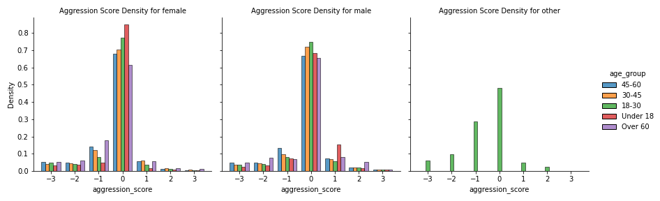
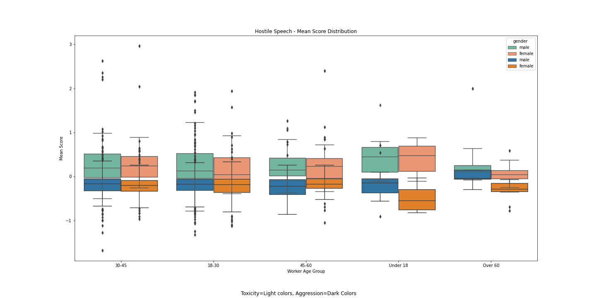

# data-512-a2
Directory for DATA 512-A2: Bias in Wikipedia Talk Corpus Data
# Project Goal
The goal of this project is to analyze two or more datasets from the Wikipedia Talk Corpus on hostile speech to identify sources of bias and interpret any implications of the bias if the datasets are used to train and test machine learning models. The datasets from Figshare: https://figshare.com/projects/Wikipedia_Talk/16731 contain annotated comments that classify hostile speech found in the comments. The two datasets used in this project are Aggression and Toxicity. The output of this project contains two csv files containing dataframes and 6 graphs showing the results of the analysis.
# Resources
Figshare Input Datasets
- Aggression: https://figshare.com/articles/dataset/Wikipedia_Talk_Labels_Aggression/4267550
- Toxicity: https://figshare.com/articles/dataset/Wikipedia_Talk_Labels_Toxicity/4563973

Detox Wiki
- Landing Page: https://meta.wikimedia.org/wiki/Research:Detox
- Schema: https://meta.wikimedia.org/wiki/Research:Detox/Data_Release

Perspective Hacks
- Demo Apps: https://github.com/conversationai/perspectiveapi/wiki/perspective-hacks
- API Repo: https://github.com/conversationai/perspectiveapi/blob/master/2-api/methods.md

# Output Datasets
aggression_visualizations.csv (too large for repo, generate using py notebook)
| column                  | value     | description                            | data type |
|-------------------------|-----------|----------------------------------------|-----------|
| worker_id               | num       | unique id                              | integer   |
| english_first_language  | num       | indicator (1,0)                        | integer   |
| rev_id                  | num       | unique comment id                      | integer   |
| aggression              | num       | indicator (1, 0)                       | integer   |
| aggression_score        | num       | value from (-3,3)                      | float     |

aggressionToxicity_visualizations.csv 
| column                  | value     | description                            | data type |
|-------------------------|-----------|----------------------------------------|-----------|
| worker_id               | num       | unique id                              | integer   |
| english_first_language  | num       | indicator (1,0)                        | integer   |
| rev_id                  | num       | unique comment id                      | integer   |
| aggression              | num       | indicator (1, 0)                       | integer   |
| aggression_score        | num       | mean score value                      | float     |
| toxicity                | num       | indicator (1, 0)                       | integer   |
| toxicity_score          | num       | mean score value                       | float     |

# Analysis Results Summary

# Data Issues and Considerations
The datasets from figshare are large in size therefore they must be accessed by the links provided in the resources section above. The output csv used in analysis 1 is too large for this repo and must be generated from within the python notebook.
